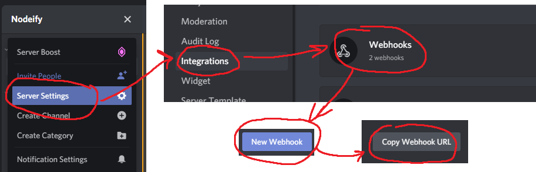

# Welcome to Wike's GPU Stock Nodeifier
- This bot uses a simple fetch and check to notify you (through Discord) when BestBuy has an Nvidia RTX 3090 founders edition in stock
- This bot will continue to spam ping you with a link to the page every 5 seconds until either you kill the process or the card goes out of stock

## To get started: 
- Install npm, and run "npm install" from this directory
- Make a copy of the .env-template file and rename it to ".env"
- Populate PING_GROUP_ID="" with the role ID that you want tagged in notifications
- Populate WEBHOOK_ID="" and WEBHOOK_TOKEN="" with information from
your webhook URL, or just populate the WEBHOOK_FULL_URL with the webhook url
- "npm start" and let it run in the background 24/7. 
- These cards sell quick, so there's never a guarantee unless you want to use a different bot to add it to your cart and buy it

## How-To:
### Enable Discord developer mode to obtain the Role ID:

### Create a webhook and get it's URL:
